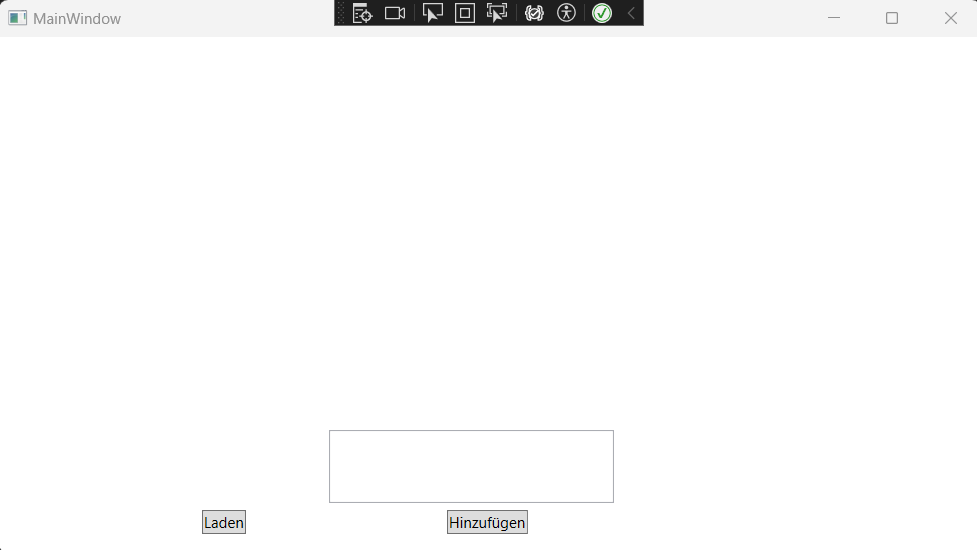
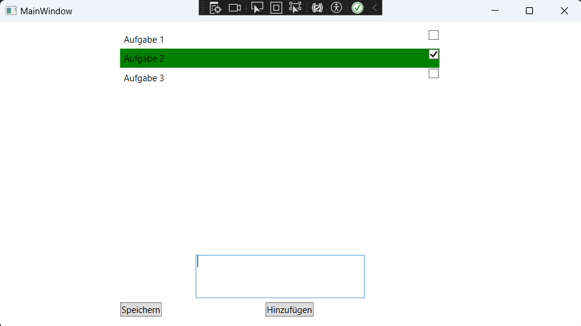

# To-Do-Liste

## WPF-Anwendung mit C# 

Neue Aufgaben werden als Grid Objekte mit Label für den Aufgabentext und CheckBox für den Status der Aufgabe erstellt. Die Liste kann mit dem Speichern-Button als .Json Datei gespeichert werden und, wenn die Liste leer ist, kann die gespeicherte Liste püer Laden-Button geladen werden.

